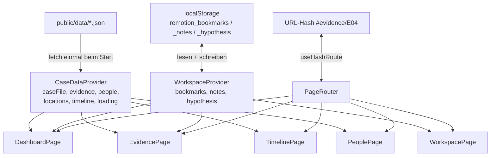

# UE3 – Demo 7: Komponenten-Hierarchie für die ganze App

> Aufgabe: Eine Komponenten-Hierarchie für die **gesamte** App entwerfen und darstellen – Seiten
> (eine pro View) und die wiederverwendbaren Komponenten (Karten, Badges, Buttons, Formular-Controls,
> …), auch wenn die meisten erst in Übung 4/5 gebaut werden. Für mindestens 5 Komponenten notieren,
> welche Daten/Props sie brauchen und woher diese kommen. Dazu drei Fragen zu den
> Abgrenzungskriterien, zu einer mehrfach verwendeten Komponente und zum Nutzen des Gesamtentwurfs.
>
> Skript: Kapitel 15, _React Foundations_ (PDF S. 102–109).

**Legende:** ✅ = wird in Übung 3 gebaut (Shell: Demo 9, Dashboard: Demo 10) · ⏳ = Übung 4/5 ·
🔁 = wiederverwendet an mehreren Stellen

---

## 1. Hierarchie

```
<App>                                             ✅ main.tsx → react.html
└─ <CaseDataProvider>                             ✅ lädt case/people/locations/evidence/timeline EINMAL
   └─ <WorkspaceProvider>                         ✅/⏳ Bookmarks (Dashboard braucht die Anzahl), Notizen, Hypothese
      └─ <AppShell>                               ✅
         ├─ <Header>                              ✅ Logo, Titel, Untertitel
         │  └─ <NavBar>                           ✅
         │     └─ <NavButton> ×5                  ✅ 🔁
         ├─ <LoadingOverlay>                      ✅
         ├─ <PageRouter>                          ✅ wählt Seite anhand des Hash
         │  │
         │  ├─ <DashboardPage>                    ✅
         │  │  ├─ <IntroCard>                     ✅
         │  │  │  └─ <HowToItem> ×4               ✅ (Button → navigiert)
         │  │  ├─ <CaseSummaryCard>               ✅
         │  │  │  └─ <Badge>                      ✅ 🔁
         │  │  ├─ <StatGrid>                      ✅
         │  │  │  └─ <StatCard> ×5                ✅ 🔁
         │  │  ├─ <ReviewProgressBar>             ✅
         │  │  ├─ <RecentEvidenceList>            ✅
         │  │  │  └─ <MiniListItem> + <Badge>     ✅ 🔁
         │  │  └─ <RecentTimelineList>            ✅
         │  │     └─ <MiniListItem>               ✅ 🔁
         │  │
         │  ├─ <EvidencePage>                     ⏳
         │  │  ├─ <EvidenceToolbar>               ⏳
         │  │  │  ├─ <SearchInput>                ⏳
         │  │  │  ├─ <FilterSelect> type/status/relevance   ⏳ 🔁
         │  │  │  ├─ <PersonSelect>               ⏳ 🔁
         │  │  │  ├─ <LocationSelect>             ⏳ 🔁
         │  │  │  ├─ <SortSelect>                 ⏳
         │  │  │  └─ <Button> „Clear filters“     ⏳ 🔁
         │  │  ├─ <EvidenceList>                  ⏳
         │  │  │  ├─ <EmptyState>                 ⏳ 🔁
         │  │  │  └─ <EvidenceCard> ×n            ⏳
         │  │  │     ├─ <BookmarkButton>          ⏳
         │  │  │     ├─ <Badge> critical/status/relevance  ⏳ 🔁
         │  │  │     └─ <TagChip> ×n              ⏳ 🔁
         │  │  └─ <EvidenceDetail>                ⏳
         │  │     ├─ <WarningBanner> (critical), <TagChip>  ⏳ 🔁
         │  │     ├─ <FilterSelect> Status/Relevanz bearbeiten  ⏳ 🔁
         │  │     └─ <NoteEditor>                 ⏳
         │  │
         │  ├─ <PeoplePage>                       ⏳
         │  │  ├─ <TabBar>                        ⏳
         │  │  ├─ <PersonCard> ×6                 ⏳
         │  │  └─ <LocationCard> ×6               ⏳
         │  │
         │  ├─ <TimelinePage>                     ⏳
         │  │  ├─ <TimelineToolbar>               ⏳
         │  │  │  ├─ <SortSelect> (Reihenfolge)   ⏳
         │  │  │  ├─ <PersonSelect>, <LocationSelect>  ⏳ 🔁
         │  │  │  └─ <FilterSelect> Ereignistyp   ⏳ 🔁
         │  │  ├─ <TimelineEventItem> ×n          ⏳
         │  │  │  ├─ <Badge> certainty            ⏳ 🔁
         │  │  │  └─ <EvidenceLink> ×n            ⏳ 🔁
         │  │  └─ <EvidenceQuickView>             ⏳
         │  │     └─ <Modal>                      ⏳
         │  │
         │  ├─ <WorkspacePage>                    ⏳
         │  │  ├─ <BookmarkList>  → <MiniListItem> + <EvidenceLink>  ⏳ 🔁
         │  │  ├─ <NotesList>     → <MiniListItem>                   ⏳ 🔁
         │  │  └─ <HypothesisForm>                ⏳
         │  │     ├─ <PersonSelect>               ⏳ 🔁
         │  │     ├─ <FilterSelect> Art des Vorfalls  ⏳ 🔁
         │  │     ├─ <EvidenceMultiSelect>        ⏳
         │  │     ├─ <ConfidenceSlider>           ⏳
         │  │     └─ <Button> „Save“              ⏳ 🔁
         │  │
         │  └─ <NotFound> / Redirect aufs Dashboard  ✅
         └─ <Footer>                              ✅
```

### Datenfluss (wer hält welchen Zustand?)



**Prinzip:** Daten, die **mehrere Seiten** brauchen, liegen **oberhalb** des Routers (Provider).
Zustand, den **nur eine Seite** braucht (Suchbegriff, Filter, offene Detailansicht, Tab), liegt
**in dieser Seite** (`useState`) – oder, wenn er teilbar/bookmarkbar sein soll, in der URL.

---

## 2. Props und Datenherkunft (≥ 5 Komponenten)

| Komponente                 | Props / Daten                                                                                     | Woher kommen sie?                                                                                                                                                                                   |
| -------------------------- | ------------------------------------------------------------------------------------------------- | --------------------------------------------------------------------------------------------------------------------------------------------------------------------------------------------------- |
| **`<StatCard>`**           | `value: number`, `label: string`                                                                  | Von `DashboardPage`, die die Werte aus dem Context **berechnet** (`evidence.length`, `people.length`, `locations.length`, `bookmarks.length`, Anzahl reviewed). Die Karte selbst kennt keine Daten. |
| **`<Badge>`**              | `variant: "reviewed" \| "unreviewed" \| "flagged" \| "critical" \| "relevant"`, `children` (Text) | Vom jeweiligen Eltern-Element, das aus dem Datenfeld die Variante ableitet (`ev.status`, `ev.relevance`, `evt.certainty`, `caseFile.status`).                                                       |
| **`<ReviewProgressBar>`**  | `reviewed: number`, `total: number` (Prozent berechnet sie selbst)                                | `DashboardPage` zählt aus `evidence` (Context) die reviewed-Einträge.                                                                                                                               |
| **`<RecentEvidenceList>`** | `items: Evidence[]` (schon auf die letzten 5 gekürzt)                                             | `DashboardPage`: `evidence.slice(-5).reverse()` aus dem `CaseDataProvider`.                                                                                                                         |
| **`<NavButton>`**          | `view: ViewName`, `label: string`, `active: boolean`, `onNavigate(view)`                          | `NavBar` (feste Liste der 5 Views) + aktueller View aus `useHashRoute()`.                                                                                                                           |
| **`<EvidenceCard>`**       | `evidence: Evidence`, `bookmarked: boolean`, `onToggleBookmark(id)`, `onOpen(id)`                 | `EvidenceList` (gefilterte Liste aus `EvidencePage`-State + Context); `bookmarked` + `onToggleBookmark` aus dem `WorkspaceProvider`.                                                                |
| **`<PersonSelect>`**       | `value: string`, `onChange(id)`, `people: Person[]`, `placeholder?: string`                       | `people` aus `CaseDataProvider`; `value`/`onChange` vom Elternteil (Evidence-Filter, Timeline-Filter oder Hypothese – jeweils eigener State).                                                       |
| **`<HypothesisForm>`**     | `people`, `evidence` (für die Auswahllisten), `draft: HypothesisDraft`, `onSave(draft)`           | Listen aus `CaseDataProvider`, Entwurf + Speichern aus `WorkspaceProvider` (`localStorage`). Ungespeicherte Eingaben: lokaler State im Formular.                                                    |
| **`<TimelineEventItem>`**  | `event: TimelineEvent`, `locationNames: string[]`, `onOpenEvidence(id)`                           | `TimelinePage` (gefilterte/sortierte Liste; Ortsnamen per Lookup aus `locations` im Context).                                                                                                       |
| **`<CaseSummaryCard>`**    | `title`, `status`, `summary` (oder ganzes `caseFile: CaseFile`)                                   | `CaseDataProvider` (`case.json`).                                                                                                                                                                   |

Die Typen (`Evidence`, `Person`, `TimelineEvent`, `CaseFile`, `HypothesisDraft`) existieren schon in
`js/types.ts` (Übung 2) und werden von den React-Komponenten wiederverwendet.

---

## 3. Frage 1 – Kriterien: eigene Komponente oder inline?

Eine eigene Komponente, wenn **mindestens eines** zutrifft:

1. **Wiederverwendung:** Das Stück UI kommt an ≥ 2 Stellen vor (`Badge`, `StatCard`,
   `MiniListItem`, `PersonSelect`).
2. **Listen-Element:** Es wird per `.map()` mehrfach erzeugt → braucht einen `key` und profitiert
   davon, dass React jedes Element einzeln vergleichen kann (`EvidenceCard`, `TimelineEventItem`,
   `PersonCard`).
3. **Eigener Zustand oder eigenes Verhalten:** `BookmarkButton` (Klick), `NoteEditor`
   (Texteingabe), `HypothesisForm` (Formular-State), `Modal` (offen/zu).
4. **Klar abgegrenzte Aufgabe mit eigenem Namen:** Man kann in einem Satz sagen, was sie tut
   („zeigt den Prüf-Fortschritt“ → `ReviewProgressBar`). Der Name dokumentiert den Code.
5. **Größe/Lesbarkeit:** Ein Abschnitt, der die Elternkomponente unübersichtlich macht (Faustregel:
   > ~50 Zeilen JSX), z. B. `EvidenceToolbar` mit 7 Controls.
6. **Andere Datenabhängigkeit:** Ein Teil, der andere Daten braucht als der Rest (z. B.
   `RecentTimelineList` braucht `timeline`, der Rest des Dashboards nicht).

**Inline bleibt**, was einmalig, ohne Logik und kurz ist: Überschriften (`<h2>Case Dashboard</h2>`),
reine Layout-Wrapper (`<div className="dashboard-columns">`), ein einzelner Absatz.

**Nicht übertreiben:** Jede Komponente kostet Props-Weitergabe und eine Datei. Ein `<Heading>`, das
nur `<h3>` umhüllt, bringt nichts.

---

## 4. Frage 2 – Mehrfach verwendete Komponente: `<Badge>` (und `<LocationSelect>`)

### `<Badge>`

**Wo es vorkommt:** Fallstatus (Dashboard), Status in „Recent evidence“ (Dashboard), Critical +
Status + Relevanz auf jeder Evidence-Karte, Gewissheit (certainty) in der Timeline.

**Wie die Vanilla-App das gemacht hat:** Jede Stelle baut den String selbst zusammen:

```ts
'<span class="badge ' + getStatusBadgeClass(ev.status) + '">' + ev.status + "</span>"; // dashboard.ts, evidence.ts
'<span class="badge ' + getRelevanceBadgeClass(ev.relevance) + '">' + ev.relevance + "</span>"; // evidence.ts
'<span class="badge badge-critical">Critical</span>'; // evidence.ts
"&nbsp;&middot;&nbsp;<span class=\"badge badge-" + certaintyBadgeClass(item.certainty) + ...  // timeline.ts
'<span class="badge badge-flagged">' + status.toUpperCase() + "</span>"; // dashboard.ts
```

- Das **Markup** ist an 6 Stellen dupliziert.
- Die **Farb-Logik** ist über **drei** Funktionen in zwei Dateien verteilt (`getStatusBadgeClass`,
  `getRelevanceBadgeClass` in `utils.ts`, `certaintyBadgeClass` in `timeline.ts`), jeweils mit
  anderem Rückgabeformat (`"badge-reviewed"` vs. `"reviewed"`).
- Der Fallstatus ist hart als `badge-flagged` verdrahtet, egal welcher Status.

**Mit Komponente:**

```tsx
<Badge variant={statusVariant(ev.status)}>{ev.status}</Badge>
```

Eine Stelle für Markup, CSS-Klassen und Barrierefreiheit (z. B. später `aria-label`). Eine neue
Variante oder ein Design-Änderung wirkt überall gleichzeitig, und TypeScript erzwingt gültige
`variant`-Werte.

### `<LocationSelect>` – Duplikation, die schon auseinandergelaufen ist

Die Orte-Auswahl wird in der Vanilla-App **zweimal** von Hand gebaut – und ist dabei bereits
**inkonsistent** geworden:

```ts
// js/views/evidence.ts:46  → Evidence-Filter zeigt "L01 - Human-Robot Interaction Laboratory"
'<option value="' + loc.id + '">' + loc.id + " - " + loc.name + "</option>";
// js/views/timeline.ts:26  → Timeline-Filter zeigt nur "L01"
'<option value="' + loc.id + '">' + loc.id + "</option>";
```

Dasselbe gilt für die Personen-Auswahl (3 × kopiert: Evidence-Filter, Timeline-Filter,
Hypothese). Genau das verhindert eine einzige `<LocationSelect>`/`<PersonSelect>`-Komponente: eine
Definition, überall dieselbe Beschriftung.

---

## 5. Frage 3 – Warum jetzt schon die ganze Hierarchie entwerfen?

1. **Zustand an die richtige Stelle legen.** Bookmarks werden vom Dashboard (Anzahl), von Evidence
   (Stern) und vom Workspace (Liste) gebraucht. Wer nur das Dashboard plant, legt sie vielleicht
   lokal ins Dashboard – und muss sie in Übung 4 mühsam „hochziehen“ (_lifting state up_). Mit dem
   Gesamtbild ist klar: `WorkspaceProvider` oberhalb des Routers, schon jetzt.
2. **Wiederverwendbare Bausteine richtig zuschneiden.** `Badge`, `StatCard`, `MiniListItem` werden
   in Demo 10 fürs Dashboard gebaut, aber später von Evidence, Timeline und Workspace genutzt. Wenn
   man das weiß, baut man `Badge` gleich mit allen Varianten statt nur mit „reviewed“.
3. **Routing-Anforderungen für die Shell.** Evidence braucht später Routen mit Parameter
   (`#evidence/E04`), damit Querverweise nicht mehr per DOM-Hack + `setTimeout` laufen (Demo 4). Die
   Shell aus Demo 9 sollte das von Anfang an vorsehen.
4. **Einheitliche Namen und Schnittstellen.** Alle Seiten folgen demselben Muster (`XxxPage` +
   Toolbar + Liste + Item), alle Selects dieselbe Props-Form (`value`/`onChange`).
5. **Aufwand abschätzen und Arbeit aufteilen.** Man sieht, was Übung 4 und 5 noch kosten, und
   könnte Komponenten im Team verteilen.
6. **Billig zu ändern.** Ein Fehler im Diagramm kostet einen Strich, ein Fehler in 20 Komponenten
   kostet einen Refactor.

---

## 6. Live-Demo in der Übung

1. Das Diagramm (Abschnitt 1) zeigen, die ✅-Teile als Plan für Demo 9 und 10 benennen.
2. Im Code die Badge-Duplikation zeigen (`grep -n "badge" js/views/*.ts`).
3. Im Browser die LocationSelect-Inkonsistenz zeigen: Evidence-Filter „Location“ aufklappen vs.
   Timeline-Filter „Location“ aufklappen.
4. Die Props-Tabelle für `StatCard`, `Badge`, `EvidenceCard`, `PersonSelect` durchgehen.
